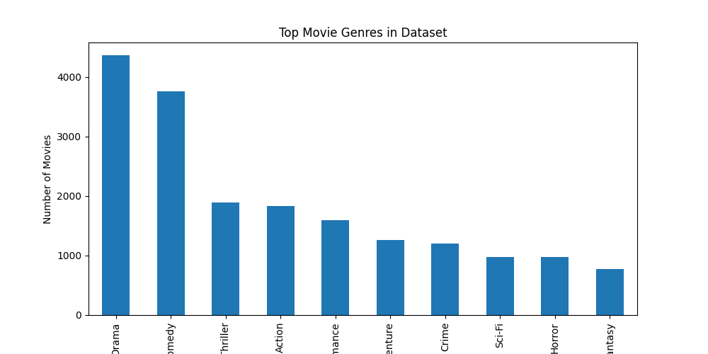

# 🎬 AI Movie Recommendation System

An intelligent Movie Recommendation System built using Machine Learning and Natural Language Processing (NLP). This project analyzes movie genres and recommends similar movies based on user input using TF-IDF vectorization and Cosine Similarity.

Instead of random suggestions, the system understands genre patterns between movies and finds the most relevant recommendations.

---

## 🚀 Project Overview

This AI system transforms movie genres into numerical vectors and measures similarity between movies. When a user provides a movie title, the algorithm searches the dataset and returns the top 10 most similar movies.

The recommendation engine uses content-based filtering, which focuses on movie attributes rather than user behavior.

---

## 📊 Dataset

Dataset used: MovieLens Latest Small Dataset

Total Movies: 9742  
Dataset Source: GroupLens Research

Columns used:
- movieId
- title
- genres

Dataset link:
https://grouplens.org/datasets/movielens/

---

## 🧠 How The AI Works

The recommendation pipeline follows these steps:

1. Load the movie dataset  
2. Extract movie genres  
3. Convert genres into vectors using TF-IDF  
4. Compute similarity between movies using Cosine Similarity  
5. Rank movies by similarity score  
6. Recommend the top 10 most similar movies

This approach is commonly used in real-world recommendation systems.

---

## ⚙️ Technologies Used

Python  
Pandas  
NumPy  
Scikit-Learn  
Matplotlib  
Jupyter Notebook

---

## 📈 Genre Distribution Visualization

The dataset is analyzed to understand which genres appear most frequently.

---

## 🎥 Example Recommendation

Input

recommend_movies("Toy Story (1995)")

Output

Toy Story 2 (1999)  
A Bug's Life (1998)  
Monsters Inc. (2001)  
Aladdin (1992)  
The Lion King (1994)  
Finding Nemo (2003)  
Shrek (2001)  
Cars (2006)  
Up (2009)

The system recommends movies with similar genre characteristics.

---

## 📁 Project Structure

movie-recommendation-system

movies.csv  
recommendation_model.ipynb  
genre_distribution.png  
requirements.txt  
README.md

---

## 🛠 Installation

Clone the repository

git clone https://github.com/henil-modi/movie-recommendation-system.git

Navigate to the project folder

cd movie-recommendation-system

Install dependencies

pip install -r requirements.txt

Run the notebook

recommendation_model.ipynb

---

## 💡 Future Improvements

Hybrid recommendation system  
User-rating based recommendations  
Web interface using Streamlit  
Integration with movie APIs  
Deep learning based recommendation models

---

## 👨‍💻 Author

Henil Modi  
